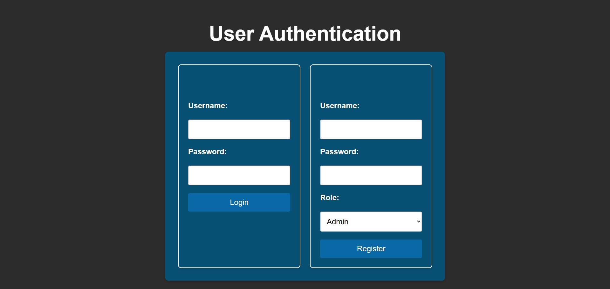

# Geo Goes to Web - Interactive Map Application 🗺️


## Youtube Link 📝

[Youtube Link](https://youtu.be/aQZzEo4KqR4)

## Description
Geo Goes to Web is a web-based application that enables users to interact with geographical data through an interactive map interface. The application features role-based authentication, allowing different levels of access for administrators, teachers, and regular users.

## Features ⭐
- 🔐 User authentication with role-based access control
- 🗺️ Interactive map interface using Leaflet.js
- 📍 Add, edit, and delete points on the map
- 📸 Image upload capability for points
- 📊 Export data in GeoJSON format
- 📱 Responsive design for all devices
- 💬 Comment system for points
- 🏷️ Category-based point organization
- 🔍 Advanced search and filtering
- 📊 User activity tracking
- 🔄 Real-time updates
- 📱 Mobile-friendly interface

## Tech Stack 💻

### Frontend
- HTML5
- CSS3
- JavaScript
- Leaflet.js

### Backend
- Node.js
- Express.js
- Microsoft SQL Server
- JWT Authentication

### Dependencies
```json
{
  "bcrypt": "^5.1.1",
  "bcryptjs": "^2.4.3",
  "body-parser": "^1.20.3",
  "cors": "^2.8.5",
  "express": "^4.21.2",
  "mssql": "^11.0.1",
  "multer": "^1.4.5-lts.1"
}
```

## Database Schema 📊

```sql
-- Users Table
CREATE TABLE users (
    id INT IDENTITY(1,1) PRIMARY KEY,
    username NVARCHAR(50) UNIQUE NOT NULL,
    password NVARCHAR(255) NOT NULL,
    role_id INT NOT NULL,
    last_login DATETIME,
    created_at DATETIME DEFAULT GETDATE()
);

-- Points Table
CREATE TABLE points (
    id INT IDENTITY(1,1) PRIMARY KEY,
    latitude FLOAT NOT NULL,
    longitude FLOAT NOT NULL,
    description NVARCHAR(MAX),
    image_url NVARCHAR(255),
    created_by INT,
    created_at DATETIME DEFAULT GETDATE(),
    FOREIGN KEY (created_by) REFERENCES users(id)
);

-- Polygons Table
CREATE TABLE polygons (
    id INT IDENTITY(1,1) PRIMARY KEY,
    name NVARCHAR(100) NOT NULL,
    coordinates NVARCHAR(MAX) NOT NULL,
    style NVARCHAR(MAX),
    created_at DATETIME DEFAULT GETDATE()
);

-- Lines Table
CREATE TABLE lines (
    id INT IDENTITY(1,1) PRIMARY KEY,
    name NVARCHAR(100) NOT NULL,
    coordinates NVARCHAR(MAX) NOT NULL,
    style NVARCHAR(MAX),
    created_at DATETIME DEFAULT GETDATE()
);

-- Roles Table
CREATE TABLE roles (
    id INT IDENTITY(1,1) PRIMARY KEY,
    role_name NVARCHAR(50) NOT NULL
);

-- Insert default roles
INSERT INTO roles (role_name) VALUES 
    ('Admin'),
    ('Teacher'),
    ('User');

```

## API Endpoints 🛣️

### Authentication
```
POST /api/auth/register - Register new user
POST /api/auth/login    - User login
GET  /api/auth/profile  - Get user profile
PUT  /api/auth/profile  - Update user profile
```

### Points Management
```
GET    /api/points         - Get all points
POST   /api/points         - Add new point
PUT    /api/points/:id     - Update point
DELETE /api/points/:id     - Delete point
GET    /api/points/geojson - Export as GeoJSON
GET    /api/points/category/:id - Get points by category
```

### Categories
```
GET    /api/categories     - Get all categories
POST   /api/categories     - Create category
PUT    /api/categories/:id - Update category
DELETE /api/categories/:id - Delete category
```

### Comments
```
GET    /api/comments/point/:id - Get comments for point
POST   /api/comments          - Add comment
PUT    /api/comments/:id      - Update comment
DELETE /api/comments/:id      - Delete comment
```

## Role-Based Access Control 👥

### Admin (role_id: 1)
- Full access to all features
- Can export GeoJSON
- Can modify and delete points

### Teacher (role_id: 2)
- View and delete points
- Cannot modify points
- Cannot export GeoJSON

### User (role_id: 3)
- View points only
- No modification privileges
- No export privileges

## Installation & Setup 🚀

1. **Clone the repository**
```bash
git clone [repository-url]
cd geogame
```

2. **Configure Database**
```javascript
// config.js
module.exports = {
    server: "YOUR_SERVER_NAME",
    user: "YOUR_USERNAME",
    password: "YOUR_PASSWORD",
    database: "GeoGameDB",
    options: {
        encrypt: true,
        enableArithAbort: true,
        trustServerCertificate: true,
    },
};
```

3. **Install Dependencies**
```bash
npm install
```

4. **Start the Server**
```bash
npm start
```

## Project Structure 📁
```
├── Frontend/
│   ├── auth.html        # Authentication page
│   ├── add-point.html   # Main map interface
│   ├── styles.css       # Global styles
│   └── js/
│       ├── auth.js      # Authentication logic
│       └── add-point.js # Map interaction logic
│
├── Backend/
│   ├── server.js        # Main server file
│   ├── config.js        # Database configuration
│   └── uploads/         # Image storage
│
└── README.md
```

## Security Features 🔒
- Bcrypt password hashing
- JWT authentication
- Role-based access control
- Protected API endpoints
- SQL injection prevention
- Secure file upload handling
- Rate limiting
- Input sanitization

## Frontend Features 🎨
- Interactive map with Leaflet.js
- Real-time point management
- Responsive design
- User-friendly interface
- Form validation
- File upload preview
- Success/error notifications
- Category filtering
- Comment system interface
- Real-time updates

## Backend Features ⚙️
- RESTful API architecture
- Token-based authentication
- File upload handling
- Database connection pooling
- Error handling middleware
- CORS support
- Request validation

## Error Handling 🚨
- Client-side input validation
- Server-side request validation
- Proper HTTP status codes
- Descriptive error messages
- Token expiration handling
- File upload restrictions

## Future Improvements 🚀
- [ ] Advanced analytics dashboard
- [ ] Offline mode support
- [ ] Push notifications
- [ ] Multi-language support
- [ ] Advanced reporting features
- [ ] Mobile application
- [ ] Social sharing features
- [ ] Integration with external mapping services

## Acknowledgments 🙏
- Leaflet.js for mapping functionality
- Express.js community
- Microsoft SQL Server team

## Application Screenshots 📸

### Login & Register Page


### Main Map Interface


### Point Management


### Database View


### User Authentication


